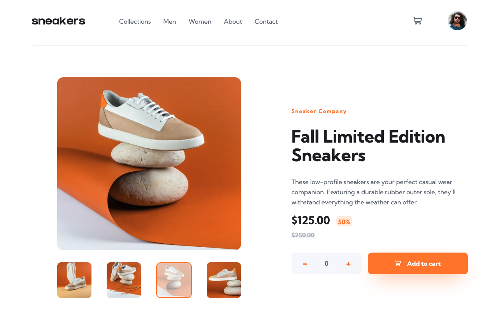
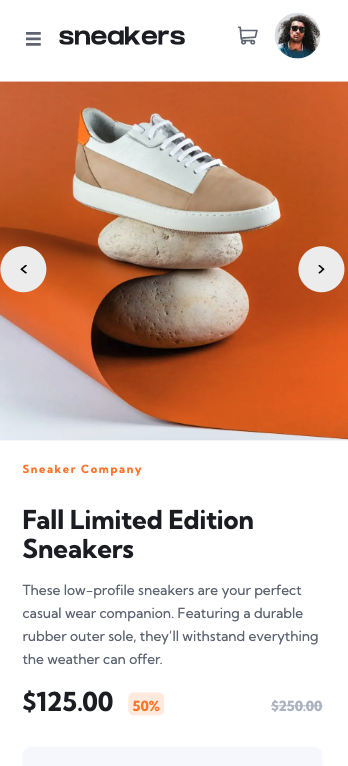

# Frontend Mentor - E-commerce product page solution

This is a solution to the [E-commerce product page challenge on Frontend Mentor](https://www.frontendmentor.io/challenges/ecommerce-product-page-UPsZ9MJp6). Frontend Mentor challenges help you improve your coding skills by building realistic projects.

## Table of contents

- [Overview](#overview)
  - [The challenge](#the-challenge)
  - [Screenshot](#screenshot)
  - [Links](#links)
- [My process](#my-process)
  - [Built with](#built-with)
  - [What I learned](#what-i-learned)
  - [Continued development](#continued-development)
  - [Useful resources](#useful-resources)
- [Author](#author)
- [Acknowledgments](#acknowledgments)

## Overview

### The challenge

Users should be able to:

- View the optimal layout for the site depending on their device's screen size
- See hover states for all interactive elements on the page
- Open a lightbox gallery by clicking on the large product image
- Switch the large product image by clicking on the small thumbnail images
- Add items to the cart
- View the cart and remove items from it

### Screenshot

### Links

- Solution URL: [solution URL](https://github.com/btebe/e-commerce-page)
- Live Site URL: [live site URL](https://e-commerce-page-xsy3.vercel.app/)

## My process

### Built with

- Semantic HTML5 markup
- CSS custom properties
- Flexbox
- CSS Grid
- [Next.js](https://nextjs.org/) - React framework

### What I learned

I learned alot about accessibility in this challenge. I took a step back and took a course on semantic HTML and accessibility courses. It was abit of a learning curve, but i managed to incorporate it to my project. As a result, i was able to manuver the websit via keyboard. Also, i was able to make the lightbox keyboard friendly. Also, when in lightbox state, i managed to trap the focus there until the user exits it by using the focus-trap-react library.

### Continued development

I wish to continue to make future websites more accessible. whether taking more courses on the topic or watching youtube videos on how to implement it standardly.

### Useful resources

- [Example resource 1](https://codesandbox.io/s/react-modal-form-pop-up-forked-7gszgj) - This is my forked project from the original project created by krissnawat. This helped me to understand and create a lightbox with focus trap.
- [Example resource 2](https://www.linkedin.com/learning/ux-foundations-accessibility/welcome?autoplay=true) - This helped understand the importance of accessibility in a website.
- [Example resource 3](https://www.linkedin.com/learning/react-accessibility/accessibility-in-react?autoplay=true) - This helped on how to use react to make a website more accessible.

## Author

- Website - [Basma Tebe](https://basma94tebe.wixsite.com/my-site)
- Frontend Mentor - [@btebe](https://www.frontendmentor.io/profile/btebe)

## Acknowledgments

I would like to give my gratitude to all the people above that are mentioned in my useful resources section. Also, i would like to give appreciation to the whole wide web for making alot of resources available.
